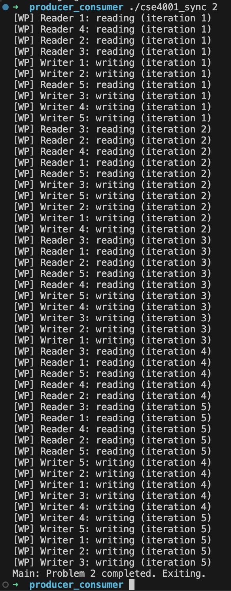
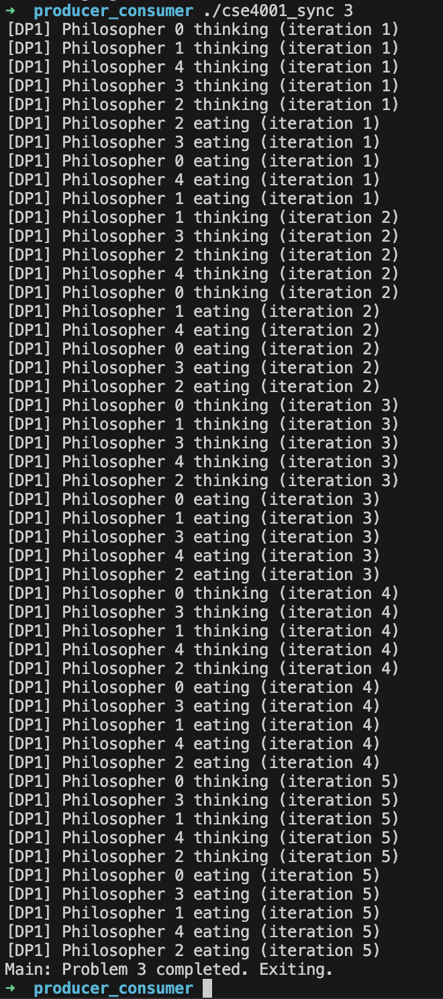

# Multi-Thread Synchronization Using Semaphores
## Description: Implement the solution for the following synchronization problems:
1. No-starve readers-writers solution (5 readers, 5 writers)
2. Writer-priority readers-writers solution (5 readers, 5 writers)
3. Dining philosophers solution #1
4. Dining philosophers solution #2

### No-starve readers-writers Solution:

### Writer-priority readers-writers solution

### Dining philosophers solution #1

### Dining philosophers solution #2
